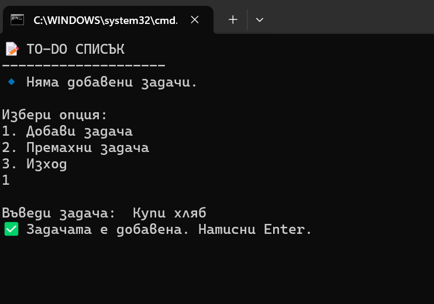

# Project1 – ToDo Console App 📝

---

## 📝 Описание

Това е конзолно приложение, създадено с .NET, което представлява списък със задачи (ToDo списък).  
Потребителят може да добавя, премахва и преглежда задачи чрез интерактивно меню.

---

## 🔧 Технологии

- .NET 9 (или .NET 6/8)
- C#
- Visual Studio / Terminal

---

## 🚀 Инсталация и стартиране

1. Клонирай хранилището:

    ```bash
    git clone https://github.com/beatriskr/dotnet-portfolio.git
    cd dotnet-portfolio/Project1
    dotnet run
    ```

---

## 📸 Скрийншот



> 📌 Ако скрийншотът не се показва, увери се, че си качила файл с име `screenshot.png` в папката `Project1`.

---

## 🧱 Файлова структура

```text
Project1/
│
├── Program.cs          # Основна логика на приложението
├── Project1.csproj     # .NET конфигурационен файл
├── .gitkeep            # Празна placeholder файл за папката
└── README.md           # Този документ
```


## 🧪 Пример за използване (код)

```csharp
Console.WriteLine("Въведи задача: ");
var task = Console.ReadLine();
tasks.Add(task); ```


---

## ✅ TODO

- [ ] Запазване на задачите във файл
- [ ] Зареждане на задачи при стартиране
- [ ] Проверка за повтарящи се задачи
