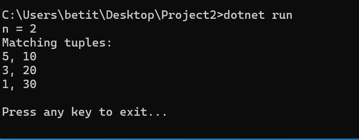

# Project2 – Обработка на n-торки от файл 📊

## 🧾 Описание  
Това е конзолно .NET приложение, което изчита наредени **n-торки от числа**, разделени със запетая, от файл. Извлича само тези, при които **втората стойност** завършва на същата цифра като **предпоследната** от факултетен номер.

## 💡 Условие  
- n = (ФН % 4) + 2 → ФН: `22251421008` → n = 2  
- От всички наредени двойки, програмата извежда само тези, при които втората стойност завършва на **същата цифра като предпоследната на ФН** (в случая – `0`).

## 🛠️ Технологии  
- C#  
- .NET Core (версия 6 или 8)  
- Visual Studio / Terminal  

## 🧪 Инсталация и стартиране

```bash
git clone https://github.com/[твоят-профил]/dotnet-portfolio.git
cd dotnet-portfolio/Project2/Project2
dotnet run
```

## 📁 Структура на проекта  

```
Project2/
├── MyTuple.cs         // Клас за представяне на двойките
├── Program.cs         // Главен файл с логиката
├── data.txt           // Входен файл с n-торки
├── Project2.csproj    // Файл с конфигурация на проекта
└── README.md          // Описание на проекта
```

## 📄 Съдържание на входния файл (`data.txt`)

```
5,10
3,20
7,14
6,18
1,30
2,25
```

## ✅ Очакван резултат при изпълнение

```
n = 2
Matching tuples:
5, 10
3, 20
1, 30

Press any key to exit...
```

## 📸 Скриншот от работеща програма  



## 🧩 Как работи  

- Изчислява се `n` от факултетния номер  
- Чете се всеки ред от `data.txt`  
- Всеки ред се превръща в `MyTuple`  
- С `LINQ` се филтрират само двойките, при които втората стойност завършва на цифрата от ФН  
- Изходът се отпечатва в конзолата


## 🔄 Диаграма на потока (Mermaid)

```mermaid
flowchart TD
    Start([Стартиране на програмата])
    ChooseOption{Нова или съществуваща дъска?}
    NewBoard[Създаване на нова дъска]
    LoadBoard[Зареждане от JSON]
    ShowBoard[Показване на Kanban дъската]
    KeyPress{Клавиш натиснат?}
    AddTask[[F2: Добавяне на задача]]
    MoveToProgress[[F5: В "In Progress"]]
    MoveToDone[[F6: В "Done"]]
    SaveExit[[F9: Запис и изход]]

    Start --> ChooseOption
    ChooseOption -->|Нова| NewBoard --> ShowBoard
    ChooseOption -->|Съществуваща| LoadBoard --> ShowBoard
    ShowBoard --> KeyPress
    KeyPress --> AddTask --> ShowBoard
    KeyPress --> MoveToProgress --> ShowBoard
    KeyPress --> MoveToDone --> ShowBoard
    KeyPress --> SaveExit


## 👩‍💻 Автор  
Разработено от **Беатрис Крумова** като част от учебно .NET портфолио.

