# Project3 – Console Kanban Board 🧩

## 🧾 Описание  
Това е .NET конзолно приложение, което реализира **Kanban дъска**, представена в терминала с три колони:  
**To Do**, **In Progress** и **Done**. Задачите се добавят, преместват и записват във файл чрез функционални клавиши.

## 💡 Условие  
- Kanban дъската съдържа максимум **10 задачи на колона**
- Задачите имат **заглавие и описание**
- Поддържат се следните действия:
  - `[F1]` Преглед на описание на задача
  - `[F2]` Добавяне на задача
  - `[F5]` Преместване в "In Progress"
  - `[F6]` Преместване в "Done"
  - `[F9]` Запис в JSON и изход
- При стартиране се избира дали да се **зареди съществуваща дъска** или да се **създаде нова**

## 🛠️ Технологии  
- C#  
- .NET 8  
- System.Text.Json  
- Visual Studio Code / Terminal  

## 🧪 Инсталация и стартиране

```bash
git clone https://github.com/[твоят-профил]/dotnet-portfolio.git
cd dotnet-portfolio/Project3
dotnet run
```

## 📁 Структура на проекта  

```
Project3/
├── Program.cs          // Главна логика с интерфейс и клавиши
├── KanbanBoard.cs      // Модел на дъската с трите колони
├── TaskItem.cs         // Модел на задача
├── Project3.csproj     // Конфигурация на проекта
├── ProjXY.json         // Примерен файл със запазена дъска
├── screenshot.png      // Скрийншот на дъската (визуализация)
└── README.md           // Този файл

```
## ✅ Примерна сесия в терминала
```
KANBAN BOARD : kanban_beti   (kanban_beti.json)

| To Do (2/10)       | In Progress (1/10) | Done (1/10)       |
-----------------------------------------------------------------------
| 1. SEO             | 1. Learn           | 1. Research       |
| 2. Testing         |                    |                   |
-----------------------------------------------------------------------
[F1] Task details   [F2] Add task   [F5] Set in progress   [F6] Set as done   [F9] End

```

## 📸 Скриншот от работеща програма  


## 🧩 Как работи 

- При стартиране потребителят избира дали да създаде нова дъска или да зареди съществуваща
- Всяка задача има заглавие и описание
- Преместването между колоните се извършва чрез съответните клавиши
- Данните се съхраняват в .json файл
- Интерфейсът наподобява визуално таблична Kanban дъска

  ## 🔄 Диаграма на потока (Mermaid)

```mermaid
flowchart TD
    Start([Стартиране на програмата])
    ChooseOption{Нова или съществуваща дъска?}
    NewBoard[Създаване на нова дъска]
    LoadBoard[Зареждане от JSON]
    ShowBoard[Показване на Kanban дъската]
    KeyPress{Клавиш натиснат?}
    AddTask[[F2: Добавяне на задача]]
    MoveToProgress[[F5: Към In Progress]]
    MoveToDone[[F6: Към Done]]
    SaveExit[[F9: Запис и изход]]

    Start --> ChooseOption
    ChooseOption -->|Нова| NewBoard --> ShowBoard
    ChooseOption -->|Съществуваща| LoadBoard --> ShowBoard
    ShowBoard --> KeyPress
    KeyPress --> AddTask --> ShowBoard
    KeyPress --> MoveToProgress --> ShowBoard
    KeyPress --> MoveToDone --> ShowBoard
    KeyPress --> SaveExit

```




## 👩‍💻 Автор  
Разработено от **Беатрис Крумова** като част от учебно .NET портфолио.


