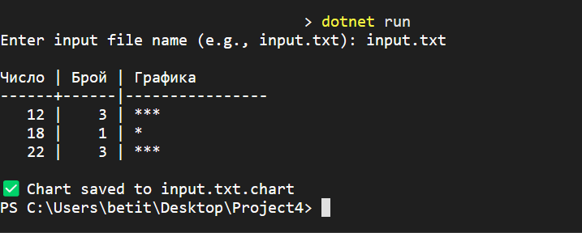

# Project4 – Графика на честота на цели числа 📊

## 🧾 Описание  
Това е .NET конзолно приложение, което анализира текстов файл с цели числа (от 1 до 120), изчислява честотата на срещане на всяко число и създава хоризонтална графика с помощта на символа `*`.

## 💡 Условие  
- Програмата чете цели числа от файл, разделени със запетая, интервал или нов ред  
- Валидни стойности са в диапазона **[1..120]**  
- Извежда се таблична графика в терминала  
- Резултатът се записва в нов файл със същото име + `.chart` разширение

## 🧮 Формула с MathJax

Броят срещания за всяко число $x_i$ се определя чрез:

$$
f(x_i) = \text{брой срещания на } x_i \text{ във файла}
$$

---

## 🛠️ Технологии  
- C#  
- .NET 8  
- Visual Studio Code  
- System.IO  
- Регулярни изрази (`Regex`)

---

## 🧪 Инсталация и стартиране

```bash
git clone https://github.com/[твоят-профил]/dotnet-portfolio.git
cd dotnet-portfolio/Project4
dotnet run

```

## 📸 Скриншот от работеща програма  

